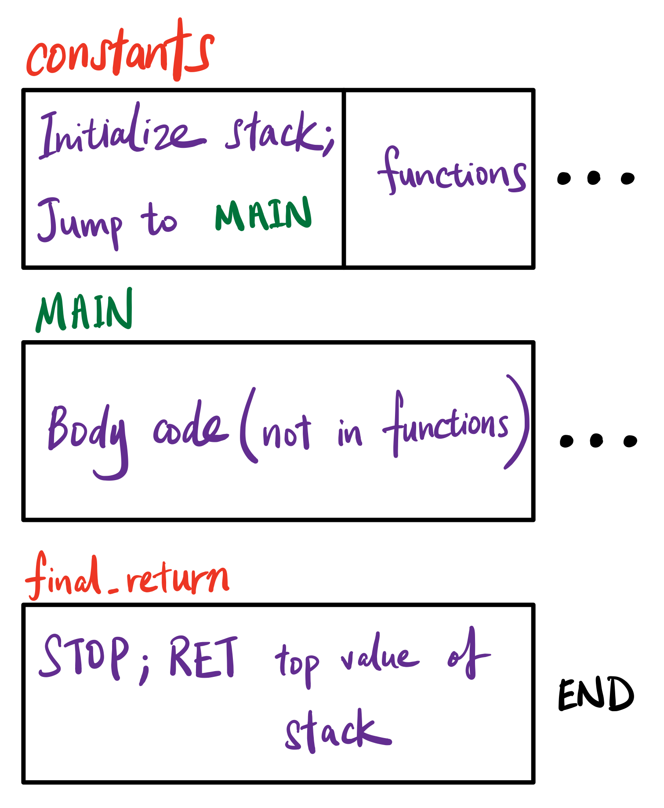
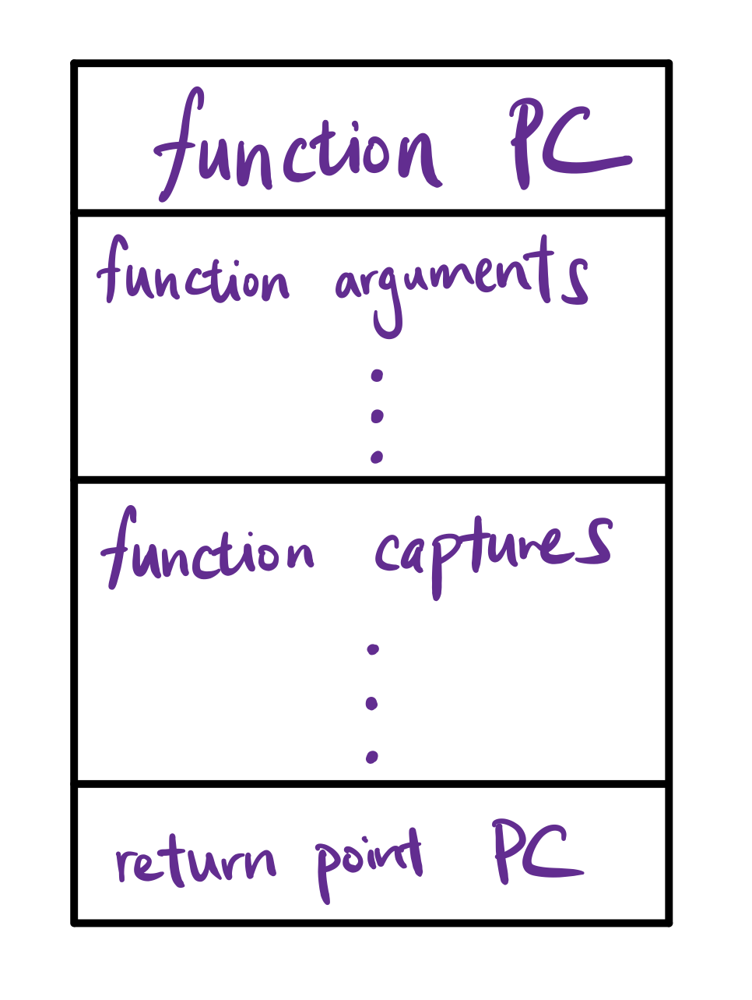
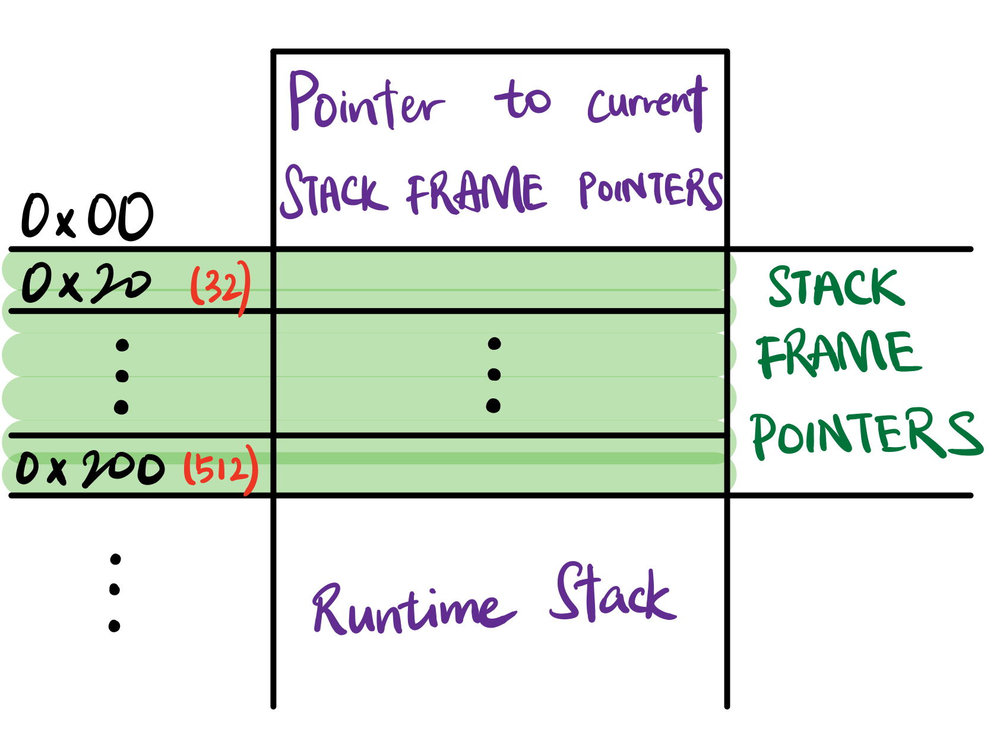
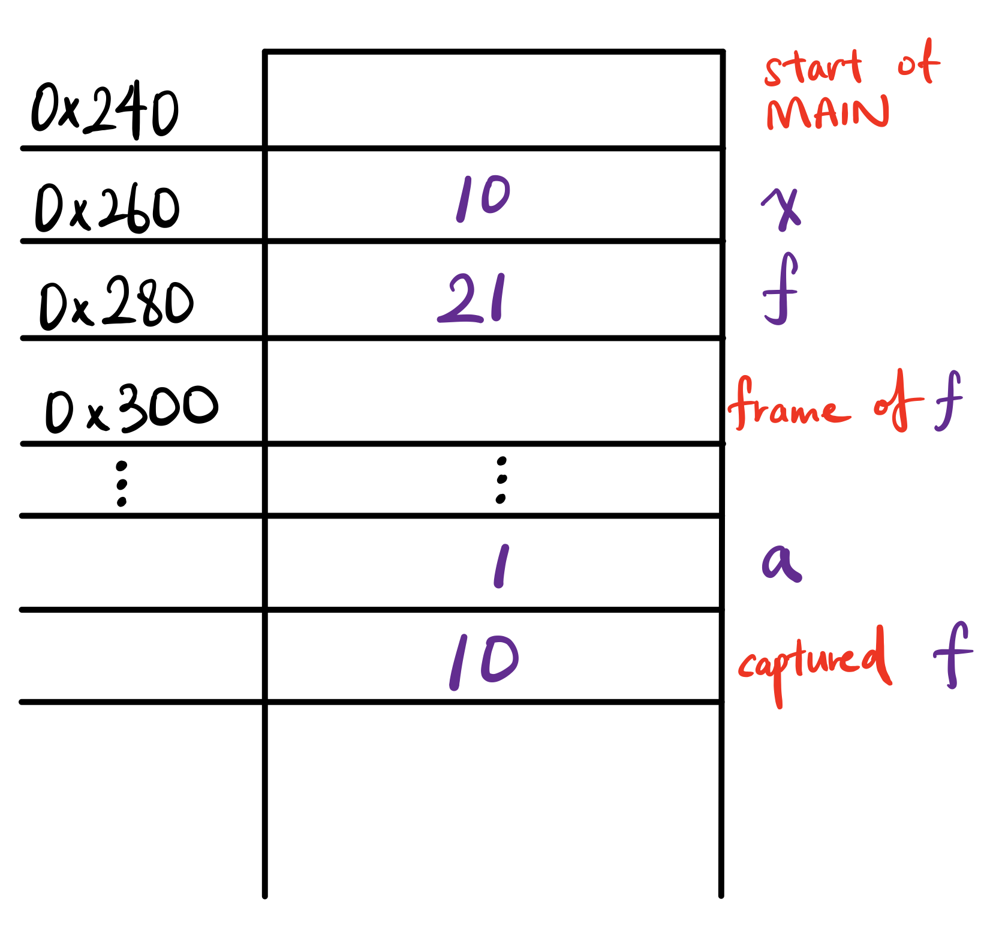

slidenumbers: true
slidecount: true
autoscale: true
slide-transition: true

## CS4215 Pontevedra

# Source To EVM Compiler

### YiJia & Yuchen

------


- **Ethereum Virtual Machine** is part of the **Ethereum Network** that handles *smart contract* deployment and execution.

- Helps to maintain and update the states of the entire blockchain, containing millions of executable objects, each with its own permanent data store.
- Abstraction of computation and storage.

------


# quasi-Turing complete

- Can compute any algorithm that can be computed by any Turing machine, given the limitations of finite memory
- Upper bound of execution processes by available **gas**.
- **gas** == 💰
- All program executions will halt.

------

# Primer on hexadecimals

- EVM encodes numbers in base-16.
- One digit can take on $$2^4-1=15$$ values, therefore it is 4 bytes.
- So `uint8` would correspond to 2 hexadecimal digits (`00~FF`)

------

# EVM Architecture

#### *applicable to this project

- Word Size: 256 bits
- Stores all in-memory values on a **STACK<sup>*</sup>**.
- A volatile **MEMORY<sup>*</sup>**.
- A permanent STORAGE.

------

# Instruction Set (OpCodes)

1. Arithmetic and bitwise logic operations
2. Stack, memory and storage access.
3. Control flow operations

------

[.footer: to view opcode details, please visit [ethervm.io](ethervm.io)]

| Bytecode   | Stack Input            | Stack Output | Effect                                                 |
| ---------- | ---------------------- | ------------ | ------------------------------------------------------ |
| `MLOAD`    | offset                 | value        | reads a `uint256` from memory                          |
| `MSTORE`   | offset, value          |              | writes a `uint256` to memory                           |
| `JUMPDEST` |                        |              | annotate possible jump destination                     |
| `JUMP`     | destination            |              | unconditional jump                                     |
| `JUMPI`    | destination, condition |              | jump if true                                           |
| `PC`       |                        | PC           | program counter                                        |
| `SWAPx`    | `a ... b`              |              | swap the top of the stack with the `x`-th last element |
| `DUP1`     | value                  | value, value | clones the last value on the stack                     |
| `RETURN`   | offset, length         |              | Halt execution and return output data                  |

------

# Let's start with the calculator!

------

Source Interpreter:

```javascript
3+4;
```

EVM Bytecode:

```
6020600063000002006020630000020060405252526000\ INIT
630000001D\ #LOCATION of Program Head
565B\ #JUMP over `functions`
\<========================================================= functions
7F\ #PUSH32
0000000000000000000000000000000000000000000000000000000000000003\ #uint256 3
7F\ #PUSH32
0000000000000000000000000000000000000000000000000000000000000004\ #uint256 4
01\ #ADD
60005260206000F3\ #RETURN sequence
```

------

# Why so many zeros?

## Culprit: `MSTORE` and `MLOAD`

------



# INIT

```
602060006300000200602063000002006040\
525252\
```

| Start  | End    | Value   | Purpose               |
| ------ | ------ | ------- | --------------------- |
| `0x00` | `0x20` | `0x20`  | Next available offset |
| `0x20` | `0x40` | `0x200` | Zeroth SFP            |
| `0x40` | `0x60` | `0x200` | First SFP             |


------

# END

```
60005260206000F3
```

`MSTORE` the value on top of the stack at `0x00` to be consumed by `RETURN`.


------

# Some supported features 🤩

1. Unary `NOT`, Binary logical operators
2. `const` declaration and static checking
3. `let` declarations
4. Conditional `if-else`
5. `while` and `for` loops
6. and MORE!

------

# Now, the all-powerful *function*!



------

# Example



```javascript
let x = 10;
function f(a) {
    return x + a;
}
f(1);
```

------

# Example



```javascript
let x = 10;
function f(a) {
    return x + a;
}
f(1);

// f(a) -> f(f, a, x)
// must be a variable named `x`!
```

------

# Demo

------

# Highlights

- Functions
  - Named, anonymous
  - Nested
  - Recursion, mutual recursion, tail call optimisation
  - Functions as parameters and return values
  	- Returned function must be applied immediately, so no functional data structure

------

# Variable capture

- Create minimal closure by scanning free variables
- Convert free variables to arguments
- Capture variables by passing them as arguments
- All passed by value, no side effects
- Name of current function passed as additional variable
  - To support mutual recursion

------

# Variable capture

```javascript
function f(x) {
    function g() {
        return z;
    }
	return x + y + g();
}
```

Free variables converted to arguments

```javascript
function f(x, y, z) {
    function g(z) {
        return z;
    }
	return x + y + g();
}
```

------

# Limitations

1. Functions supports a maximum recursive depth of 8.
2. No renaming of function name conflicts
3. Eager evaluation of all functions

# _*fin*_.
